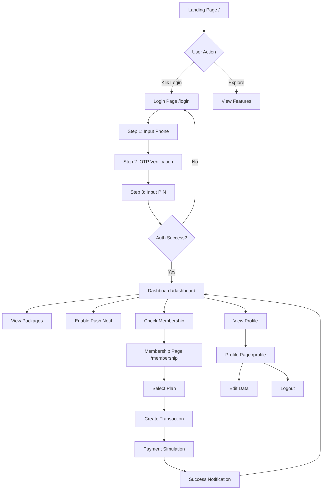

# 📱 Flow Member PWA - PickPoint

## Overview
Dokumentasi lengkap user journey untuk member PWA, dari landing page hingga membership management.

---

## 🗺️ User Journey Map



---

## 📄 Page-by-Page Breakdown

### 1. **Landing Page** (`/`)

**Purpose**: Marketing page untuk showcase fitur

**Features**:
- Hero section dengan value proposition
- Feature cards (Drop Portal, Midtrans, Dual Notif, Kiosk)
- CTA buttons:
  - "Mulai dari Admin" → `/admin/dashboard`
  - "Buka Drop Portal" → `/drop`
  - "Coba Sebagai Member" → `/login`

**Design**: Dark theme dengan gradient, glassmorphism effects

**Issues Found**: ❌ Tidak ada database error handling (admin page 500)

---

### 2. **Login Page** (`/login`)

**Purpose**: 3-step authentication flow

**Flow**:
```
Step 1: Phone Number
├─ Input nomor HP (auto-format 0 → 62)
├─ Checkbox "Ingat saya" (localStorage)
└─ Simulasi kirim OTP

Step 2: OTP Verification
├─ Input 6 digit OTP
├─ Button "Verifikasi"
└─ Button "Ubah Nomor"

Step 3: PIN Entry
├─ Input 6 digit PIN
├─ Default PIN: 123456
├─ Button "Masuk"
└─ Button "Kembali"
```

**Current Implementation**:
- ✅ Phone formatting (0xxx → 62xxx)
- ✅ Remember me functionality
- ⚠️ **OTP adalah SIMULASI** (tidak ada backend integration)
- ✅ PIN verification via `loginUser` action
- ✅ Redirect ke `/dashboard` on success

**Issues Found**:
- ⚠️ OTP step tidak fungsional (hanya UI)
- ❌ Database error: "SASL: SCRAM-SERVER-FIRST-MESSAGE: client password must be a string"

---

### 3. **Dashboard** (`/dashboard`)

**Purpose**: Main hub untuk member

**Layout**:
```
Header
├─ Greeting: "Hi, {name}" + "Selamat {pagi/siang/sore/malam}"
└─ Action Icons:
    ├─ 👑 Crown (Membership Status)
    ├─ 🔔 Bell (Enable Push Notif)
    └─ 👤 Profile

Tabs
├─ Menunggu (Pending Packages)
│   ├─ Receipt Number
│   ├─ Courier Name
│   ├─ Location
│   ├─ Price + Penalty
│   └─ Payment Status Badge
│
└─ Selesai (Completed Packages)
    ├─ Receipt Number
    └─ Completion Date
```

**Features**:
1. **Membership Sheet** (Crown icon):
   - Status badge (Aktif/Tidak Aktif)
   - Expiry date (if active)
   - CTA: "Perpanjang" or "Beli Langganan" → `/membership`

2. **Push Notification** (Bell icon):
   - Calls `requestNotificationPermission()` hook
   - Saves subscription to database
   - ✅ **Dual notification ready** (Push + WA)

3. **Package Display**:
   - Real-time data from `/api/dashboard`
   - Separate tabs for pending/completed
   - Shows price, penalty, payment status

4. **Interactive Tour**:
   - First-time user onboarding
   - 5-step guided tour
   - Stored in localStorage (`hasSeenDashboardTour`)

**Notification Integration**:
- ✅ Package arrival → Push + WA
- ✅ Membership success → Push + WA
- ✅ Membership reminder → Push + WA (manual trigger from admin)

---

### 4. **Membership Page** (`/membership`)

**Purpose**: Buy/renew membership plans

**Flow**:
```
1. Load Plans (from /api/membership-plans)
   ├─ Plan name
   ├─ Duration (days)
   ├─ Price
   └─ Description

2. Click "Beli Sekarang"
   └─ createMembershipTransaction(planId)

3. Payment Dialog Opens
   ├─ Show plan details
   ├─ Simulation mode notice
   └─ Button "Simulasi Bayar Sukses"

4. Payment Success
   ├─ simulatePaymentSuccess(transactionId)
   ├─ Update user membership in DB
   ├─ 🔔 TRIGGER NOTIFICATION (Push + WA)
   └─ Redirect to /dashboard
```

**Current Implementation**:
- ✅ Grid layout (responsive 1-2 columns)
- ✅ Transaction creation
- ⚠️ **Payment is SIMULATED** (not real Midtrans integration)
- ✅ Success notification triggers
- ✅ Auto-redirect after success

**Notification Template** (on success):
```
"Halo {name}, pembayaran membership anda berhasil! 
Masa aktif member anda telah diperpanjang hingga {expiryDate}. 
Terima kasih!"
```

---

### 5. **Profile Page** (`/profile`)

**Purpose**: User data management & logout

**Expected Features** (not viewed yet):
- Edit name, phone, unit, apartment
- Change PIN
- Logout button
- View membership status

---

## 🔔 Notification Integration Points

### 1. Package Arrival
**Trigger**: Admin creates package via `/api/packages/create`

**Template**:
```
HI {name}, Paket anda {resi} sudah dapat diambil di Pickpoint {location}. 
Untuk detail informasi dapat membuka link berikut {link}
```

**Channels**: ✅ Push + ✅ WhatsApp

---

### 2. Membership Success
**Trigger**: Payment webhook from Midtrans (type: `MEMBERSHIP_BUY`)

**Template**:
```
Halo {name}, pembayaran membership anda berhasil! 
Masa aktif member anda telah diperpanjang hingga {expiryDate}. 
Terima kasih!
```

**Channels**: ✅ Push + ✅ WhatsApp

---

### 3. Membership Reminder
**Trigger**: Manual button in Admin > Customers

**Template**:
```
Halo {name}, masa aktif membership anda akan segera berakhir pada {expiryDate}. 
Segera lakukan perpanjangan untuk tetap menikmati layanan kami.
```

**Channels**: ✅ Push + ✅ WhatsApp

---

## ⚠️ Issues & Recommendations

### 🔴 Critical Issues

1. **Database Connection Error**
   ```
   Error: SASL: SCRAM-SERVER-FIRST-MESSAGE: client password must be a string
   ```
   - **Impact**: Admin page crashes (500 error)
   - **Fix**: Check `DATABASE_URL` in `.env.local`
   - **Location**: All Prisma queries fail

2. **OTP Not Functional**
   - **Current**: UI only, no backend
   - **Impact**: Misleading UX (users think OTP is sent)
   - **Options**:
     - Remove OTP step entirely (use Phone + PIN only)
     - Implement real OTP via WhatsApp
     - Add disclaimer "OTP simulasi untuk demo"

3. **Payment Simulation Only**
   - **Current**: No real Midtrans integration in membership flow
   - **Impact**: Cannot test real payment
   - **Fix**: Integrate Midtrans Snap token

### 🟡 UX Improvements

1. **Login Flow Simplification**
   - **Current**: 3 steps (Phone → OTP → PIN)
   - **Recommendation**: 2 steps (Phone → PIN) since OTP is fake
   - **Benefit**: Faster login, less confusion

2. **Dashboard Empty State**
   - **Current**: Just shows "Tidak ada paket"
   - **Recommendation**: Add illustration + CTA
   - **Example**: "Belum ada paket? Tunggu notifikasi dari kami!"

3. **Membership CTA Visibility**
   - **Current**: Crown icon in header (not obvious)
   - **Recommendation**: Add banner if membership expired/expiring soon
   - **Example**: "⚠️ Membership akan berakhir dalam 3 hari. Perpanjang sekarang!"

4. **Notification Permission Prompt**
   - **Current**: Just a bell icon (no context)
   - **Recommendation**: Show modal explaining benefits
   - **Example**: "Aktifkan notifikasi untuk dapat update paket real-time!"

### 🟢 Enhancement Ideas

1. **Package Details Page**
   - Click package card → see full details
   - Show proof photo
   - Payment history
   - Track & trace

2. **Payment History**
   - New page: `/transactions`
   - List all transactions (packages + membership)
   - Filter by status, date

3. **Referral System**
   - Share referral code
   - Get discount for successful referrals
   - Track referral stats

4. **PWA Features**
   - Add to home screen prompt
   - Offline mode for viewing packages
   - Background sync for notifications

---

## 🎨 Design System

**Current Theme**:
- Primary: Emerald/Green
- Accent: Amber (membership), Sky (notifications)
- Background: Gradient from-primary/5 to-secondary/5
- Cards: Glass effect with border

**Typography**:
- Headers: Bold, 2xl-3xl
- Body: Regular, sm-base
- Muted: text-muted-foreground

**Components** (shadcn/ui):
- Card, Button, Badge, Sheet, Dialog, Tabs
- Toast for notifications
- Responsive grid layouts

---

## 🚀 Next Steps

### Immediate Fixes (Priority 1)
1. ✅ Fix database connection error
2. ✅ Remove or implement real OTP
3. ✅ Add Midtrans Snap integration for membership

### UX Improvements (Priority 2)
4. ✅ Simplify login flow
5. ✅ Add membership expiry banner
6. ✅ Improve notification permission UX

### Feature Enhancements (Priority 3)
7. ✅ Package details page
8. ✅ Transaction history
9. ✅ PWA manifest improvements

---

## 📊 User Flow Summary

**Happy Path**:
```
1. User lands on / → sees features
2. Clicks "Coba Sebagai Member" → /login
3. Enters phone (08xxx) → auto-converts to 62xxx
4. [Skip OTP] → Enters PIN (123456)
5. Redirected to /dashboard → sees greeting
6. Clicks bell → enables push notifications
7. Clicks crown → sees membership status
8. Clicks "Beli Langganan" → /membership
9. Selects plan → simulates payment
10. Gets notification (Push + WA) → membership active!
11. Returns to dashboard → sees updated status
```

**Total Steps**: 11 (can be reduced to 8 if OTP removed)

**Estimated Time**: 2-3 minutes for first-time user

---

## 🔗 Related Files

- **Pages**: `/src/app/(app)/{dashboard,membership,profile}/page.tsx`
- **Login**: `/src/app/login/page.tsx`
- **Actions**: `/src/actions/{auth,membership}.ts`
- **Notifications**: `/src/lib/{webpush,whatsapp}.ts`
- **Hooks**: `/src/hooks/usePushNotification.ts`
