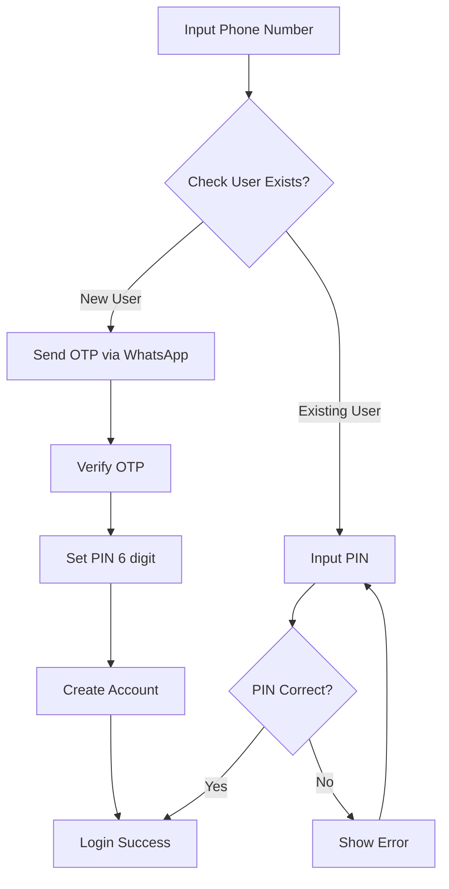
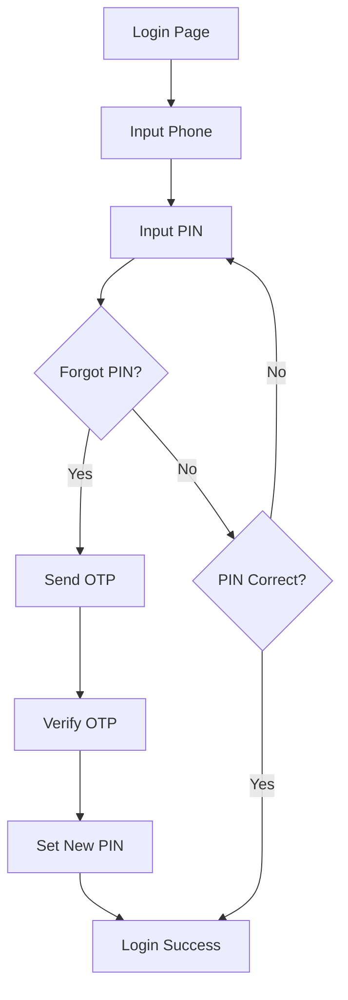

# 📝 Rekomendasi: Flow OTP untuk Registrasi

## Current Problem
- Login page memiliki 3-step flow (Phone → OTP → PIN)
- OTP saat ini **hanya simulasi** (tidak ada backend)
- User existing harus melewati OTP setiap kali login (tidak efisien)

## Recommended Solution

### Flow Baru: Deteksi User Baru vs Existing



### Implementation Details

#### 1. **Phone Number Check** (Step 1)
```typescript
// src/actions/auth.ts
export async function checkUserExists(phone: string) {
  const user = await prisma.user.findUnique({
    where: { phone },
    select: { id: true, name: true }
  });
  
  return {
    exists: !!user,
    isNewUser: !user,
    userName: user?.name
  };
}
```

#### 2. **OTP Generation & Send** (Only for New Users)
```typescript
// src/actions/otp.ts
export async function sendOTP(phone: string) {
  // Generate 6-digit OTP
  const otp = Math.floor(100000 + Math.random() * 900000).toString();
  
  // Store in database with expiry (5 minutes)
  await prisma.oTPVerification.create({
    data: {
      phone,
      code: otp,
      expiresAt: new Date(Date.now() + 5 * 60 * 1000)
    }
  });
  
  // Send via WhatsApp
  await sendWhatsAppMessage({
    to: phone,
    message: `Kode OTP PickPoint Anda: ${otp}\nBerlaku 5 menit.`
  });
  
  return { success: true };
}
```

#### 3. **OTP Verification**
```typescript
export async function verifyOTP(phone: string, code: string) {
  const verification = await prisma.oTPVerification.findFirst({
    where: {
      phone,
      code,
      expiresAt: { gt: new Date() },
      verified: false
    }
  });
  
  if (!verification) {
    return { success: false, message: "OTP tidak valid atau sudah kadaluarsa" };
  }
  
  // Mark as verified
  await prisma.oTPVerification.update({
    where: { id: verification.id },
    data: { verified: true }
  });
  
  return { success: true };
}
```

#### 4. **Updated Login Page Flow**
```typescript
// src/app/login/page.tsx
const handlePhoneSubmit = async () => {
  const result = await checkUserExists(phone);
  
  if (result.isNewUser) {
    // New user → send OTP
    await sendOTP(phone);
    setStep("otp");
    toast({
      title: "OTP Terkirim",
      description: `Kode verifikasi dikirim ke ${phone} via WhatsApp`
    });
  } else {
    // Existing user → skip to PIN
    setStep("pin");
    toast({
      title: `Selamat datang kembali, ${result.userName}!`,
      description: "Masukkan PIN Anda"
    });
  }
};
```

### Database Schema Addition

```prisma
// prisma/schema.prisma
model OTPVerification {
  id        String   @id @default(cuid())
  phone     String
  code      String
  verified  Boolean  @default(false)
  expiresAt DateTime
  createdAt DateTime @default(now())
  
  @@index([phone, code])
}
```

---

## Benefits

### ✅ Security
- OTP via WhatsApp memverifikasi kepemilikan nomor HP
- Mencegah spam registrasi
- PIN hanya diset sekali saat registrasi

### ✅ User Experience
- **New user**: Phone → OTP → Set PIN → Done (one-time)
- **Existing user**: Phone → PIN → Done (fast login)
- No unnecessary OTP for returning users

### ✅ Cost Efficiency
- OTP hanya dikirim saat registrasi (sekali per user)
- Login berikutnya tidak perlu biaya SMS/WA

---

## Alternative: PIN Recovery via OTP

Jika user lupa PIN, bisa gunakan OTP untuk reset:



### Implementation

```typescript
// Add "Lupa PIN?" link in login page
<Button 
  variant="link" 
  onClick={handleForgotPIN}
>
  Lupa PIN?
</Button>

const handleForgotPIN = async () => {
  await sendOTP(phone);
  setStep("otp-reset");
  toast({
    title: "OTP Reset PIN",
    description: "Kode verifikasi dikirim untuk reset PIN"
  });
};
```

---

## Comparison: Current vs Recommended

| Aspect | Current | Recommended |
|--------|---------|-------------|
| **New User** | Phone → OTP (fake) → PIN | Phone → OTP (real) → Set PIN |
| **Existing User** | Phone → OTP (fake) → PIN | Phone → PIN (skip OTP) |
| **OTP Cost** | None (fake) | Only on registration |
| **Security** | Low (no verification) | High (phone verified) |
| **UX** | Confusing (fake OTP) | Clear & fast |
| **Forgot PIN** | Not supported | OTP reset available |

---

## Implementation Checklist

### Phase 1: Basic OTP (Recommended)
- [ ] Add `OTPVerification` model to schema
- [ ] Create `sendOTP` action
- [ ] Create `verifyOTP` action
- [ ] Update login page to check user exists
- [ ] Integrate WhatsApp OTP sending
- [ ] Test new user registration flow
- [ ] Test existing user login flow

### Phase 2: PIN Recovery (Optional)
- [ ] Add "Lupa PIN?" button
- [ ] Create OTP reset flow
- [ ] Create `resetPIN` action
- [ ] Test PIN recovery flow

### Phase 3: Rate Limiting (Important)
- [ ] Limit OTP requests (max 3 per hour per phone)
- [ ] Add cooldown between OTP sends (60 seconds)
- [ ] Log OTP attempts for security monitoring

---

## Security Considerations

### 1. **Rate Limiting**
```typescript
// Check recent OTP requests
const recentOTPs = await prisma.oTPVerification.count({
  where: {
    phone,
    createdAt: { gt: new Date(Date.now() - 60 * 60 * 1000) } // last hour
  }
});

if (recentOTPs >= 3) {
  return { 
    success: false, 
    message: "Terlalu banyak permintaan. Coba lagi dalam 1 jam." 
  };
}
```

### 2. **OTP Expiry**
- Default: 5 minutes
- Auto-cleanup expired OTPs (cron job)

### 3. **Brute Force Protection**
```typescript
// Limit OTP verification attempts
const failedAttempts = await prisma.oTPVerification.count({
  where: {
    phone,
    verified: false,
    createdAt: { gt: new Date(Date.now() - 15 * 60 * 1000) }
  }
});

if (failedAttempts >= 5) {
  return { 
    success: false, 
    message: "Terlalu banyak percobaan gagal. Minta OTP baru." 
  };
}
```

---

## Cost Estimation

Assuming:
- WhatsApp OTP cost: Rp 200/message
- 100 new registrations/month
- 0 OTP for existing users (login with PIN)

**Monthly Cost**: Rp 20,000 (100 × Rp 200)

**vs Current (if real OTP for every login)**:
- 100 users × 10 logins/month = 1,000 OTPs
- Cost: Rp 200,000/month

**Savings**: Rp 180,000/month (90% reduction)

---

## Recommendation Summary

### ✅ Implement This Flow:
1. **New User**: Phone → OTP (WhatsApp) → Set PIN → Done
2. **Existing User**: Phone → PIN → Done (no OTP)
3. **Forgot PIN**: Phone → OTP → Reset PIN

### ✅ Benefits:
- Secure phone verification for new users
- Fast login for existing users (no OTP)
- 90% cost reduction vs OTP every login
- Better UX (no fake OTP confusion)

### ⚠️ Important:
- Add rate limiting to prevent abuse
- Set OTP expiry (5 minutes)
- Log all OTP attempts for security
- Clean up expired OTPs regularly

---

## Next Steps

1. **Review this recommendation** with your team
2. **Decide**: Implement OTP or keep current flow?
3. **If yes**: I can implement Phase 1 (basic OTP)
4. **Timeline**: ~2-3 hours implementation + testing

**Mau saya implementasikan sekarang?** 🚀
